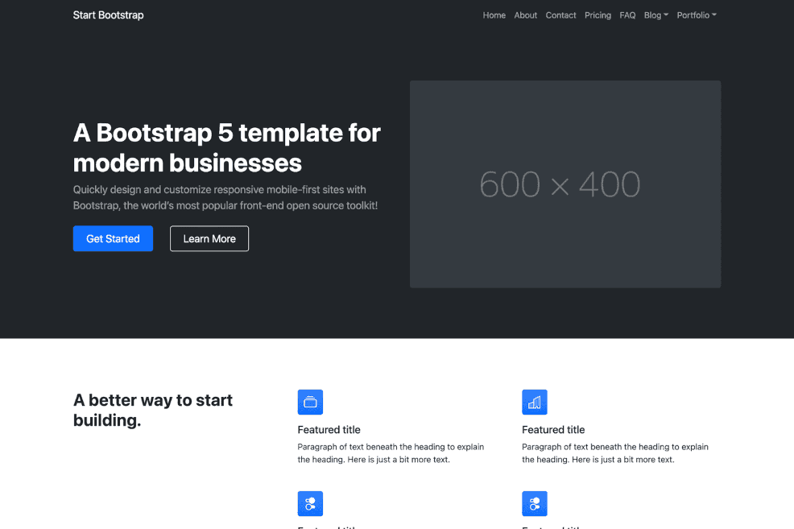

# Bootstrap Business

A multipurpose Bootstrap full website template ported from Start Bootstrap.

> __Requires__ Devflow Version: 2.x

> __Tested Up To:__ 2.x

> __Requires PHP:__ 8.4+

> __Stable Tag:__ 1.0.0

> __License:__ GPLv2-only

## Screenshot


## Localization
Portuguese, Chines (Simplified), German, English, Spanish, French, Italian Japanese, and Russian

## Composer Installation
1. Start a new shell session.
2. In the root of your install, run the following command ```composer require getdevflow/bootstrap-business```.

## Changelog

### 1.0.0
- Initial addition
